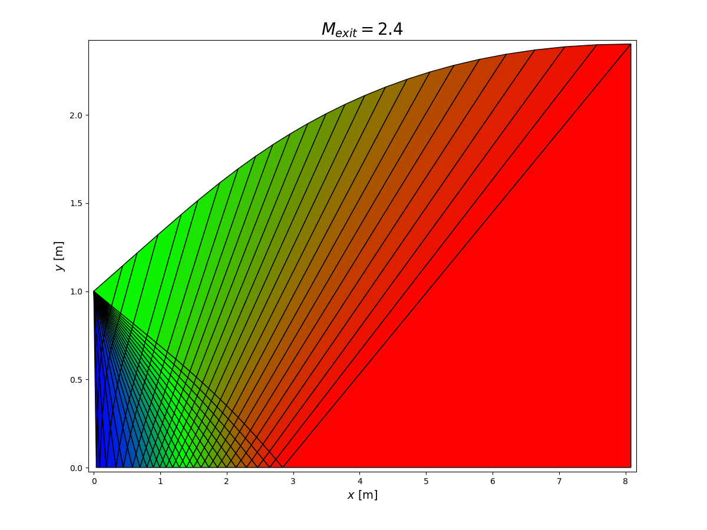

# apsCFD #

The project solves the conservation laws (mass, momentum and energy) for a physical
domain by executing:

1. Geometry Definition
2. Mesh / Grid Generation
3. Application of Boundary Conditions
4. Solve Conservation Laws
5. Post-Processing

## Geometry ##

The geometry defines the physical domain over which the conservation laws will
be applied. For simplicity, this project requires the a geometry that is symmetrical
about the y-axis. The geometry is input via a piecewise-defined function.

## Method of Characteristics ##

- [Concepts of Gasdynamics](https://www.aoe.vt.edu/content/dam/aoe_vt_edu/programs/graduate/forms/lectnotes3-09All101812.pdf)
- [MatLab Documentation](https://www.mathworks.com/help/aerotbx/examples/solving-for-the-exit-flow-of-a-supersonic-nozzle.html)

## Mesh/Grid Generation ##

Grid generation is the process of covering the physical domain defined by the
geometry into a mesh such that small, discrete volumes/elements are identified upon 
which the conservation laws can be applied. The grid used has a significant impact
on rate of convergence, solution accuracy and CPU time required.

For this project, a structured grid is used (as opposed to an unstructured grid).
A structured grid features regular connectivity and can be generated using the
algebraic method.

TODO: Update mesh script to initialize MeshGrid and Mesh classes and to handle multiple domains

## Initial Conditions ##

- Atmospheric model as a function of altitude

## Boundary Conditions ##

## Physics ##

- [Cantera - Chemical Kinetics & Thermodynamics](http://www.cantera.org/docs/sphinx/html/cython/tutorial.html)
- [FEniCS - PDE Solver](https://fenicsproject.org/tutorial/)

## Post-Processing ##

## Miscellaneous ##

- [Dynamic Mesh](https://github.com/meshadaptation/pragmatic)
- Parallelization
