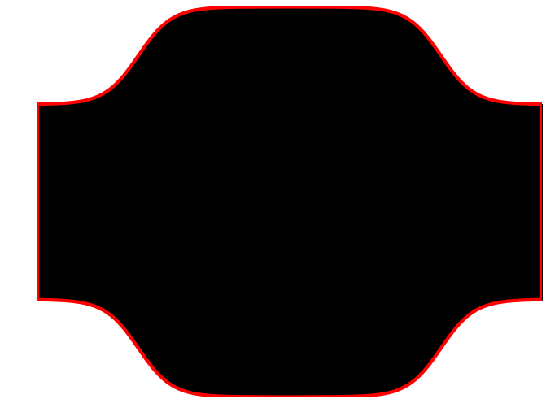

# apsCFD #

The project solves the conservation laws (mass, momentum and energy) for a physical
domain by executing:

1. Geometry Definition
2. Mesh / Grid Generation
3. Application of Boundary Conditions
4. Solve Conservation Laws
5. Post-Processing

## Geometry ##

The geometry defines the physical domain over which the conservation laws will
be applied. For simplicity, this project requires the a geometry that is symmetrical
about the y-axis. The geometry is input via a piecewise-defined function.

The user specifies the:
* Maximum and minimum x-domain values
* A piecewise function for the upper y-domain
* A piecewise function for the lower y-domain

Here is an example geometry representing a pressure vessel:

## Grid Generation ##

Grid generation is the process of covering the physical domain defined by the
geometry into a mesh such that small, discrete volumes/elements are identified upon 
which the conservation laws can be applied. The grid used has a significant impact
on rate of convergence, solution accuracy and CPU time required.

For this project, a structured grid is used (as opposed to an unstructured grid).
A structured grid features regular connectivity and can be generated using the
algebraic method.
